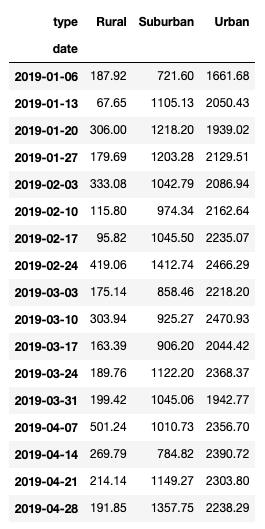
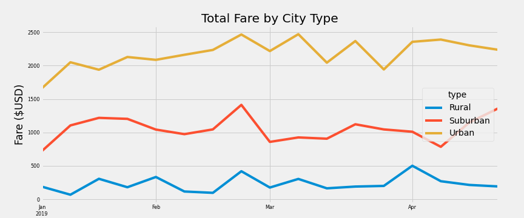

# PyBer Analysis
## Overview
### The ask from PyBer
PyBer, a ride-sharing app company, asked that a summary DataFrame of the ride-sharing data by city type be created. Then, they requested the creation of a multiple-line graph that shows the total weekly fares for each city type. Lastly, they asked for a summary of how the data differs by city type and how those differences can be used by decision-makers at PyBer.

## Results
### Differences in ride-sharing data among the different city types

In reviewing the ride sharing data, it's clear that there is a fairly substantial difference in total fares between rural, suburban and urban city types. Throughout the January 1 to April 28 timeframe, the urban weekly urban fare totals are around ten times greater than rural fare totals, and are often more than twice suburban fare totals. For all three city types, the middle of the period tended to have the highest fare totals, with the peak in late February and early March (see the *Total fares by week DataFrame* and the *Total Fare by City Type Line Chart*, below).
##### *Total Fare by City Type DataFrame*

##### *Total Fare by City Type Line Chart*

## Summary
### Three business recommendations
Based on these results, showing fairly significant differences in weekly fare totals between city types, here are three business recommendations:
* Since weekly total fares in rural cities are so low, it may make sense to increase the number of drivers in those cities, to increase total fare revenue while also hopefully bringing down the average fare cost for riders.
* Since weekly total fares in suburban cities are doing respectably well, it may also make sense to increase the number of drivers in those cities, to increase total fare revenue and try to more closely match the total fares found in urban cities.
* Since weekly total fares in rural cities are very low compared to suburban and urban cities, another direction worth considering would be to pull PyBer out of rural areas altogether, especially since earlier analysis showed average fares to be more expensive in rural areas, causing affordability to be an issue for riders.
